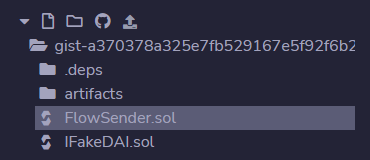
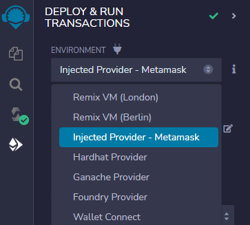
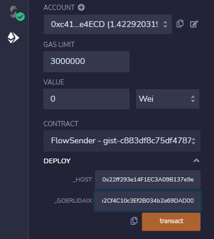
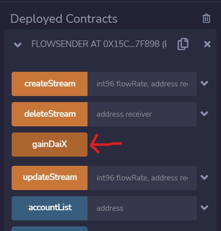
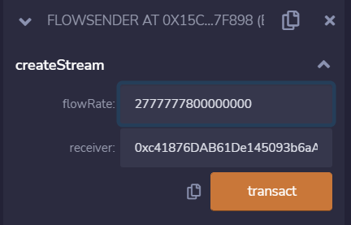

<Section name="1. Introduction" description="Introduction to superfluid">

## What is Superfluid

The way we usually move tokens on-chain is through basic ERC20 transfers. I transfer you 100 DAI and my balance goes down 100 and yours goes up 100.

Superfluid's smart contract framework takes this a step forward by introducing a new token standard, called the Super Token. The Super Token extends the basic ERC20 transfer functionality to include Super Agreements. These Super Agreements give us new and more powerful ways to move tokens on-chain!

The most popular Super Agreement lets us *stream* Super Tokens - it's called the Constant Flow Agreement (CFA). We also provide another Super Agreement called the Instant Distribution Agreement (IDA) which lets you do scalable one-to-many distributions. This guide is going to focus on money streaming with the CFA.

## Money Streaming In Solidity

Just like how a smart contract can transfer its own ERC20 tokens, you can set up a smart contract to stream its own Super Tokens. This guide will quickly walk you through how to set up a smart contract to stream Super Tokens!

<Quiz id={"ind7t"} />

Regular ERC20 Tokens can be streamed
- True
- False [✅]

</Section>

<Section name="2. Super Tokens" description="Understanding Super Tokens">

## What are Super Tokens?

The Super Token is our extension of the ERC20 token standard that plugs into the Superfluid Protocol to include Super Agreement abilities. These Super Agreements allow Super Tokens to be transferred in powerful ways such as in streams or instant distributions. Keep in mind that Super Tokens can do everything that a traditional ERC20 token can PLUS new modes of value transfer enabled by Superfluid (i.e., money streaming).

Super Tokens come in two forms: wrapper and custom. Wrapper Super Tokens are the most common, so let's discuss them. If you'd like to understand the rarer Custom Super Token, head over [here](https://docs.superfluid.finance/superfluid/protocol-overview/in-depth-overview/super-tokens#custom).

## Wrapper Super Tokens

A wrapper Super Token is an existing ERC20 token that's been "wrapped" into a Super Token to gain Super Agreement functionality.

### Wrapping and Unwrapping

When getting Wrapper Super Tokens, you first use the `upgrade(uint256 amount)` function on the Wrapper Super Token contract. This takes the desired amount of the Wrapper Super Token's underlying ERC20 token from your wallet and mints you an equal amount of Wrapper Super Tokens. Basically, you gave up the plain underlying ERC20 token and got the "Super Token version" of it. 

Say you want to go back from Wrapper Super Tokens to the underlying ERC20 token. You would simply unwrap the desired amount with the `downgrade(uint256 amount)` function and the opposite happens; the desired amount of your Super Tokens are burned and an equal amount of the underlying ERC20 token are returned to you.


The naming convention for Wrapper Super Tokens is the original token symbol + "x" (Ex: USDC ➡ USDCx).

## Question

<Quiz id={"ddhvd"} />

There is a ERC20 token with the symbol "SUNNY". What should be the symbol of the Wrapper Super Token for SUNNY token?
- superSUNNY
- sfSUNNY
- SUNNYx [✅]
- SUNNYs

<Quiz id={"vxz3f"} />

How do you go from plain DAI to DAIx?
- Approve DAIx to spend my DAI and then call upgrade on the DAIx contract with the amount of DAI I want to wrap into DAIx. [✅]
- Approve DAI to spend my DAIx and then call upgrade on the DAIx contract with the amount of DAI I want to wrap into DAIx.
- Approve DAI to spend my DAIx and then call downgrade on the DAI contract with the amount of DAI I want to wrap into DAIx.
- Approve DAIx to spend my DAI and then call downgrade on the DAI contract with the amount of DAI I want to wrap into DAIx.

</Section>

<Section name="3. Super Agreements" description="Understanding Super Agreements">

## Super Agreements

Super Agreements are the additional value transfer functionality that Super Tokens have. When an account engages in a Super Agreement with another account, it agrees to have its Super Token balance modified according to the rules of the agreement and chosen parameters. Currently, there are two available Super Agreements: the Constant Flow Agreement (CFA) and the Instant Distribution Agreement (IDA).

The CFA is what lets you stream money, so let's talk about it!

## Calculating Balances with the CFA

Let's say your driving a car that's going 1 km per minute. If 13 minutes pass, then you would have travelled 1 km/min. * 13 min. = **13 miles**.

Now similarly, if you are streaming at a rate of 1 DAIx per second and 13 seconds pass, then you would have moved 1 DAIx/sec. * 13 min. = **13 DAI**.

With each passing second, the amount of DAIx you've moved changes to 14, to 15, and so on.

So that's all the CFA is doing; adding a *rate* component to balance calculation.

To put this mathematically, you can call the amount of DAIx you originally had as your "static balance" and then the amount you've streamed out as the "real-time balance" delta and by combining the two, you get your actual balance!

```
POV: You are streaming to someone at a rate of 1 DAIx per second and 13 seconds have passed since you started the stream.

Static Balance    = 100 DAIx
Real-Time Balance = -13 DAIx = -1 DAIx/sec * 13 seconds passed
                    --------
Actual Balance    =  87 DAIx = 100 + -13
```

Last thing to note, is that the real-time balance is accounted in the CFA's own contract. When you go to view your balance on the `balanceOf` function on the Super Token, we've overriden it to take your basic static balance and then add the real-time balance.


💡 You can see several visual examples of this process in [this](https://docs.superfluid.finance/superfluid/protocol-overview/in-depth-overview/super-agreements/constant-flow-agreement-cfa) section of our documentation.


<Quiz id={"6hyba"} />

True or False? Superfluid submits transactions every second to update my balance when I start a stream.
- True: Superfluid spends a lot on gas!
- False: You're really just reading the value off a formula in the `balanceOf()` function which uses time as a variable [✅]

<Quiz id={"6hyba"} />

You have 200 SUNNYx in your wallet. You start a stream to someone at a rate of 5 SUNNYx per second and then 20 seconds pass. You open your Metamask (which uses `balanceOf()` to display your balance). How much SUNNYx do you have?
- 200 SUNNYx
- 100 SUNNYx [✅]
- 0 SUNNYx
- 300 SUNNYx

</Section>

<Section name="Dev Resources" description="Developer Resources">

## Superfluid Developer Resources

### [Docs](https://docs.superfluid.finance)

Your go-to location for in-depth protocol information and examples.

### [Super Token Faucet](https://docs.superfluid.finance/superfluid/developers/interactive-tutorials/super-token-faucet)

Use this to get DAIx tokens on Goerli or Mumbai

### [Console](https://console.superfluid.finance)

The Etherscan of Superfluid. Useful for checking out all the money streaming activity of different accounts, drafting subgraph queries, and more.

### [Dashboard](https://app.superfluid.finance)

A no-code tool where you can connect your wallet to start streams and view your money streaming activity.

### [Solidity Library](https://docs.superfluid.finance/superfluid/developers/solidity-examples/solidity-libraries/cfav1-library)

If you’re writing smart contracts, you’ll want to include the Superfluid Ethereum contracts package, and make use of the CFA library for working with streams in your contracts.

</Section>

<Section name="Money Streaming With Solidity" description="Set up a smart contract that can stream its own Super Tokens">

# Streaming Money in Solidity

So you've seen how easy it is to stream straight from your EOA account (your plain personal wallet) using the SDK Core. Now, say you want to create a smart contract that will be able to stream tokens on its own. 

You've probably seen a contract transfer ERC20 tokens on its own with the transfer function 👇

```
IERC20(tokenAddress).transfer(receiverAddress, amountToTransfer);
```

Well, here's the equivalent for a contract streaming Super Tokens on its own 👇 It's not rocket science!

```
cfaV1.createFlow(receiverAddress, superToken, perSecondflowRate);
```

However, there is some set up needed before hand in order for your contract to begin streaming money like that - read on!

# Basic Example - FlowSender Contract

To illustrate how a contract can send money in streams, we'll use a simple contract which we'll call the FlowSender. Basically, FlowSender is going to fund itself with fDAIx and be able to create, update, and delete streams to addresses of our choosing.

Click on this [**REMIX IDE**](https://remix.ethereum.org/?#gist=c883df8c75df47870bc23c1a11d3e36a&version=soljson-v0.8.13+commit.abaa5c0e.js) link to find the FlowSender contract. Note that the IDE will open all the environment folders at once; you can close them such that the file directory looks like this:



Let's get walk through some of the code real quick!

## 1. Superfluid Set Up

First, we make these imports which are needed for setting up the contract to interact with the Superfluid Protocol:

```

import { ISuperfluid, ISuperToken } from "@superfluid-finance/ethereum-contracts/contracts/interfaces/superfluid/ISuperfluid.sol";

import {IConstantFlowAgreementV1} from "@superfluid-finance/ethereum-contracts/contracts/interfaces/agreements/IConstantFlowAgreementV1.sol";

import {CFAv1Library} from "@superfluid-finance/ethereum-contracts/contracts/apps/CFAv1Library.sol";

```

Then, we set up the CFA Library with these two bits of code in the contracts:

```
using CFAv1Library for CFAv1Library.InitData;
CFAv1Library.InitData public cfaV1;               //initialize cfaV1 variable
```
and in the constructor:
```
//initialize InitData struct, and set equal to cfaV1        
cfaV1 = CFAv1Library.InitData(
    _host,
    //here, we are deriving the address of the CFA using the host contract
    IConstantFlowAgreementV1(
        address(_host.getAgreementClass(
                keccak256("org.superfluid-finance.agreements.ConstantFlowAgreement.v1")
            ))
    )
);
```
To learn more about these instantiations, feel free to reference [here](https://docs.superfluid.finance/superfluid/developers/solidity-examples/solidity-libraries/cfav1-library#initializing-the-library) in our docs.

## 2. Getting the contract some Super Tokens

This is done by calling `gainDaiX`. Basically, this function mints the FlowSender contract 10,000 fDAI and wraps it into fDAIx.

fDAIx is a [wrapper Super Token](https://docs.superfluid.finance/superfluid/protocol-overview/in-depth-overview/super-tokens#wrapper). Its underlying token is fake DAI (fDAI).

fDAI has a public mint function which lets anyone mint their own fDAI whenever they want. Makes life easy for this tutorial!

```
function gainDaiX() external {

    // Get address of fDAI by getting underlying token address from DAIx token
    IFakeDAI fdai = IFakeDAI( goerliDaiX.getUnderlyingToken() );
    
    // Mint 10,000 fDAI
    fdai.mint(address(this), 10000e18);

    // Approve fDAIx contract to spend fDAI
    fdai.approve(address(goerliDaiX), 20000e18);

    // Wrap the fDAI into fDAIx
    goerliDaiX.upgrade(10000e18);

}
```

## 3. Creating a stream!

Here's how we get the contract to send a stream of fDAIx from itself to an address of choice with `createStream`.

```
function createStream(int96 flowRate, address receiver) external {

    // Create stream
    cfaV1.createFlow(receiver, goerliDaiX, flowRate);

}
```

## 4. Compile and Deploy the FlowSender

**Head to the Compile tab to compile the FlowSender contract**


**Make sure your Metamask is connected to Goerli Testnet and switch the Environment to `Injected Provider - Metamask`**



**Head to the Deploy tab and deploy the contract with the following parameters:**

You can find these addresses in our docs [here](https://docs.superfluid.finance/superfluid/developers/networks#test-networks).

The address of the Superfluid Host contract on Goerli Testnet

`_HOST` - 0x22ff293e14F1EC3A09B137e9e06084AFd63adDF9

The address of fDAIx (the wrapper Super Token for a free mintable fDAI token) on Goerli Testnet

`_GOERLIDAIX` - 0xF2d68898557cCb2Cf4C10c3Ef2B034b2a69DAD00



## 5. Interact with FlowSender to load it with fDAIx

Call the `gainDaiX` function and the contract will gain 10,000 fDAIx.



## 6. Interact with FlowSender to send someone a stream of fDAIx

Using the `createStream` function, specify a receiver address and pick a by-the-second flow rate.

Note that this flow rate is always in wei per second. For instance, if you wanted the contract to stream 10 fDAIx/hour:

```
10 fDAIx/hour
= 10 * (10**18) fDAIx / hour
= 10 * (10**18) fDAIx / ( 60 seconds * 60 minutes )
= 2777777800000000 <- the flow rate number you would provide
```

Run the createStream as shown below:



## 7. View the stream in action.

Once the transaction confirms, head to the [Superfluid Console](https://console.superfluid.finance) and paste the address in the search bar at the top. Click in and see the balance of the FlowSender contract changing in real-time!

Congrats, you just started a money stream with Solidity! That wasn't so hard, was it?

For reference, check out this [FlowSender contract](https://console.superfluid.finance/goerli/accounts/0x8766e5755917D849E907cF5952C4aE8eB8e3C050?tab=streams) we already deployed ourselves and started a stream with.

</Section>

<Section name="Conclusion" description="Conclusion">

## Next Steps

Congrats, dev! You've gotten some Superfluid smart contract developement under your belt 💪


Check out these other guides to move on to more advanced concepts 👇

🚧 (More guides coming soon) 🚧

## Links

**[Discord](https://discord.gg/XsK7nahanQ)**
**[Twitter](https://twitter.com/intent/follow?screen_name=Superfluid_HQ)**
**[GitHub](https://github.com/superfluid-finance)**
**[Superfluid Continuous Hackathon](https://docs.superfluid.finance/superfluid/resources/contribute/superfluid-wave-pool)**

</Section>
