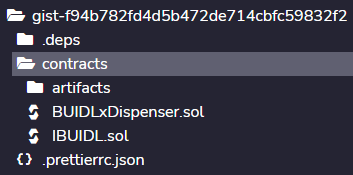

<Section name="1. Prerequisites" description="Prerequisites for this tutorial">

## Prerequisites

This guide assumes you've already completed the [**Money Streaming 101 Guide**](https://ethglobal.com/guides/introduction-to-superfluid-protocol-be10i) which overviews Superfluid and shows you the bare basics of whipping up money streams in Solidity.

Here, we'll get into Super Apps, a powerful Superfluid smart contract development feature. Let's get into it!

</Section>

<Section name="2. What's a Super App" description="Introduction to Super Apps">

## What is a Super App

Super Apps are smart contracts that are registered with the Superfluid Protocol allowing them to **react** to money streams. This reactivity is programmed in **callbacks**.

Callbacks are custom code that a developer can implement in a Super App that triggers when a stream to the Super App is created, updated, or deleted. This code could enact anything from minting an NFT to even initiating a new stream - it's super flexible.

That's all there is to it!

## Why Are Super Apps Needed?

Since Super Apps can react to money streams, they create an intermediate layer of programmability to Super Agreement's that wouldn't be possible with just wallet-to-wallet action.

As a result, applications can be made that mesh together custom logic with Super Agreements actions to create scalable dApps with innovative user experiences.

For instance, you could create a lending Super App where loan repayment is be done via money stream rather than manual and repetitive repayment transactions. Also, imagine a Super App supporting on-chain subscriptions paid through money streams with a built-in affiliate program that automatically redirects portions of subscription streams to referrers. The possibilities with Super Apps are endless!

## Question

<Quiz id={"dhewf"} />

What is the term for the custom code in Super Apps which triggers in reaction to stream actions?
- Hooks
- Callbacks
- Super Agreement
- Customization layer

<Quiz id={"edk9f"} />

Which of the following functionalities requires usage of a Super App? (Hint: Super Apps are all about reactivity!)
- A smart contract that can create multiple streams to various accounts
- A smart contract that can receive a stream
- A smart contract that increments a variable in response to a stream being opened to it
- A smart contract that lets an account mint an NFT if it has an ongoing stream open to it

</Section>

<Section name="3. Anatomy of a Super App" description="Anatomy of a Super App">

## Building a BUIDLx Dispenser

To show how to set up Super Apps, we're going to build a simple "BUIDLxDispenser" Super App and deploy it on Mumbai

All it will do is react to a stream of fDAIx by sending the sender a stream of BUIDLx tokens. If the sender stops streaming fDAIx to it, the BUIDLxDispenser will cancel the their stream of BUIDLx tokens.

First, click on this [**REMIX IDE**](https://remix.ethereum.org/#gist=7ee300d1258fd8875513ef564879c150&version=soljson-v0.8.14+commit.abaa5c0e.js&optimize=false&runs=200&evmVersion=null&lang=en) link to find the BUIDLxDispenser contract. Note that the IDE will open all the environment folders at once; you can close them such that the file directory looks like this:



## Set Up

First, we make these imports which are needed for setting up the contract to interact with the Superfluid Protocol:

```
import {ISuperfluid, ISuperToken} from "@superfluid-finance/ethereum-contracts/contracts/interfaces/superfluid/ISuperfluid.sol";

import {SuperTokenV1Library} from "@superfluid-finance/ethereum-contracts/contracts/apps/SuperTokenV1Library.sol";

import {SuperAppBaseFlow} from "@superfluid-finance/ethereum-contracts/contracts/apps/SuperAppBaseFlow.sol";
```

We need the BUIDLxDispenser to inherit `SuperAppBaseFlow` which lays out callback functions for our Super App that we can override to implement our desired functionality ([see docs](https://docs.superfluid.finance/superfluid/developers/super-apps/superappbaseflow)).

## Constructor

For this contract, we're going to store the fDAIx Super Token that will be streamed to the contract and BUIDLx Super Token that will be streamed into the contract.

To set up the `SuperAppBaseFlow` we're providing the host (which gets stored in a public `host` variable) and three booleans. The booleans stand for the following:

`activateOnCreated` - True if the Super App will be made to react to the creation of streams to it. False otherwise.
`activateOnUpdated` - True if the Super App will be made to react to the updating of streams being sent to it. False otherwise.
`activateOnDeleted` - True if the Super App will be made to react to the deletion of streams being sent to it. False otherwise.

Because our Super App is only going to respond to streams being **created** and **deleted**, we'll go for `true, false, true`.

```
    constructor(
        ISuperToken _fDAIx,
        ISuperToken _BUIDLx,
        ISuperfluid _host
    ) SuperAppBaseFlow(
        _host,
        true,
        false,
        true
    ) {

        fDAIx = _fDAIx;
        BUIDLx = _BUIDLx;
        ...

```

The following code here is to make our lives easier by minting the BUIDLxDispenser contract 10 million BUIDL tokens and wrap it into BUIDLx.

BUIDLx token is a [wrapper Super Token](https://docs.superfluid.finance/superfluid/protocol-overview/in-depth-overview/super-tokens#wrapper). Its underlying token is BUIDL. 

BUIDL token has a public mint function which lets anyone mint their own BUIDL whenever they want. Makes life easy for this tutorial!

```
    // Get the underlying BUIDL ERC20 token from the BUIDLx Super Token 
    IBUIDL buidlToken = IBUIDL( BUIDLx.getUnderlyingToken() );

    // Minting the contract 1,000,000 BUIDL tokens to start off
    buidlToken.mint(address(this), 10_000_000e18);

    // Approving the BUIDL tokens to be wrapped into BUILDx
    buidlToken.approve(address(BUIDLx), 10_000_000e18);

    // Wrapping the BUIDL into BUIDLx - now 
    BUIDLx.upgrade(10_000_000e18);
```

## Setting Accepted Super Token

We only want our BUIDLxDispenser to *only* respond to streams of fDAIx. To make sure of that, the `SuperAppBaseFlow` exposes an `isAcceptedSuperToken` which we can override as we see fit.

```
    function isAcceptedSuperToken(ISuperToken superToken) public view override returns (bool) {
        return superToken == fDAIx;
    }
```

If we hadn't set this, then you could stream any Super Token to the BUIDLxDispenser and trigger the callbacks. As a rule of thumb, make sure you set your accepted Super Tokens when writing your Super Apps to avoid unexpected behavior.

## Callbacks

Let's skip down to the other two functions in this contract: `onFlowCreated` and `onFlowDeleted`. These internal functions are our callbacks!

If I start a stream to the BUIDLxDispenser contract, `onFlowCreated` is triggered and if I delete the stream `onFlowDeleted` is triggered. 

### Let's break down `onFlowCreated` starting with the parameters 👇

```
    function onFlowCreated(
        ISuperToken superToken,
        address sender,
        bytes calldata ctx
    )
```

This looks like a lot, but it's quite simple! 
- `superToken`: the Super Token that's being streamed to the contract
- `sender`: the account creating the stream to the contract
- `ctx`: You can think of this as the initial "Superfluid state" coming into the callback (it's context!). If you do Superfluid actions in your callback (like create streams), you'll want to incorporate these changes into an updated context and return it at the end of the callback so the Superfluid Protocol understands what's new. This will become clearer below.

Let's look at the callback body now:

```
    newCtx = ctx;

    // Create stream of BUIDLx to them
    newCtx = BUIDLx.createFlowWithCtx(sender, TEN_TOKENS_PER_MONTH, newCtx);
    
    return newCtx;
```

First off, when modifying a stream in a callback, you need to call that function with the -WtihCtx suffix in its name (so here it's `createFlow**WithCtx**` instead of just `createFlow`). The `createFlowWithCtx` function will not only start the stream, but also take the `newCtx` it's been provided as its last parameter, add in the modifications due to the stream creation (a "Superfluid action"), and return it.

At the end, the newCtx is returned. Honestly, the function body here could have been just this:

```
return BUIDLx.createFlowWithCtx(sender, TEN_TOKENS_PER_MONTH, ctx);
```

But the additional `newCtx` variable helps make the context modification a bit clearer. Just for the tutorial 😉

### Now let's break down `onFlowDeleted`, starting with the parameters again 👇

```
    function onFlowDeleted(
        ISuperToken /*superToken*/,
        address sender,
        address /*receiver*/,
        int96 /*previousFlowRate*/,
        uint256 /*lastUpdated*/,
        bytes calldata ctx
    ) 
```

The new parameters here are:
- `receiver`: the receiver of the stream being deleted. It's actually possible to go rogue and delete a flow that you're *receiving* from a Super App, not just one that you're *sending to* a Super App. As a result, we provide this receiver parameter so you can handle the logic of what you might call a "rogue recipient". We're not using it here though.
- `previousFlowRate`: the flow rate of the stream before it's deleted (not being used here)
- `lastUpdated`: the timestamp of the last time the stream that's being deleted was modified (not being used here)

And the callback body:

```
    newCtx = ctx;

    // Get BUIDLx flow rate
    int96 buildxFlowRate = BUIDLx.getFlowRate(address(this), sender);

    // if sender hasn't already deleted their own BUIDLx stream, then delete it
    if (buildxFlowRate != 0) {
        newCtx = BUIDLx.deleteFlowWithCtx(address(this), sender, newCtx);
    }

    return newCtx;
```

Basically what we want here is to only delete the flow of BUILDx to the person streaming fDAIx to the BUIDLxDispenser. 

However, there's a chance that that person has already (for whatever reason) deleted the stream of BUIDLx that they were receiving from the BUIDLxDispenser (yes, Superfluid lets you cancel both streams that you're sending AND receiving). If we try to delete a stream that isn't there, we'll get a reversion. You seriously DON'T want you Super App reverting in the onFlowDeleted callback as it will [jail your Super App](https://docs.superfluid.finance/superfluid/developers/super-apps/super-app#super-app-rules-jail-system).

So to avoid with this, we just check if the `buildxFlowRate` isn't zero (so the person hasn't already canceled their stream of BUIDLx). If it isn't already zero, then it's safe to go ahead and delete the BUIDLx stream to them.

Ok, so now we've digested the contract code. Let's test it out!

</Section>

<Section name="4. Trying out the BUIDLx Dispenser" description="Trying out the BUIDLx Dispenser">

Let's actually open a stream to a live deployment of the BUIDLx Dispenser on Mumbai to see how it works. One has already been deployed to `0xdBf14425713d180DB3F019b350e2EC4C140120A2`.

**1. Get fDAIx**

Head here for an fDAIx faucet.

**2. Start a stream with the [CFAv1Forwarder on Mumbai](https://mumbai.polygonscan.com/address/0xcfA132E353cB4E398080B9700609bb008eceB125#writeContract)**

This is an easy way to start streams right on Etherscan. Connect your wallet, head to the `createFlow` function and fill in the parameters with the below:

- `token`: `0x5D8B4C2554aeB7e86F387B4d6c00Ac33499Ed01f`
- `sender`: (your address)
- `receiver`: `0xdBf14425713d180DB3F019b350e2EC4C140120A2` (address of BUIDLx Dispenser)
- `flowrate`: 10000 (honestly whatever you want)
- `userData`: `0x`

**3. View the results**

Head to the [Superfluid Console](https://console.superfluid.finance/) and search your address. You'll be able to see an outgoing stream of fDAIx to the BUIDLx Dispenser contract as well as an incoming stream of BUIDLx tokens which were started to you in response to your stream of fDAIx! 🥳

</Section>

<Section name="4. Conclusion" description="Conclusion">

You've learned the basics of Superfluid Super App development! That's huge 😤

Super Apps open up a ton of use cases - here are some we love:

1. Fixed-Rate Lending with Streamed Interest Payments

A lending protocol where interest on borrowed assets must be paid in a stream. See [Flow Theory](https://ethglobal.com/showcase/flow-theory-n1h79) for inspiration.

2. Affiliate Revenue Splitter

A smart contract that takes susbcription revenue streams and splits them out between the vendor and the affiliate who referred the subscriber (uses [User Data](https://docs.superfluid.finance/superfluid/developers/super-apps/user-data)).

3. NFT that evolves as you water it with a money stream

Check out our [growing-nft](https://github.com/superfluid-finance/super-examples/tree/main/projects/growing-nft/) example for inspiration.

If you're looking to take things even further, we run a never-ending hackathon called the [Superfluid Wave Pool](https://docs.superfluid.finance/superfluid/resources/contribute/superfluid-wave-pool) which you can build in!

## Links

**[Discord](https://discord.gg/XsK7nahanQ)**

**[Twitter](https://twitter.com/intent/follow?screen_name=Superfluid_HQ)**

**[GitHub](https://github.com/superfluid-finance)**

**[Superfluid Wave Pool](https://docs.superfluid.finance/superfluid/resources/contribute/superfluid-wave-pool)**

</Section>